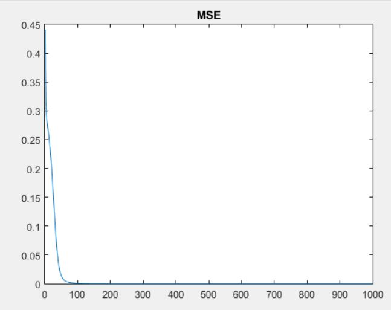
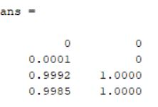

# A simple neural network (ANNs) from scratch
minimal neural network implementation from scratch using matlab. 
Run the file solve_xor.m as a matlab script

 
output:
 

 
predictions vs true labels:
 

